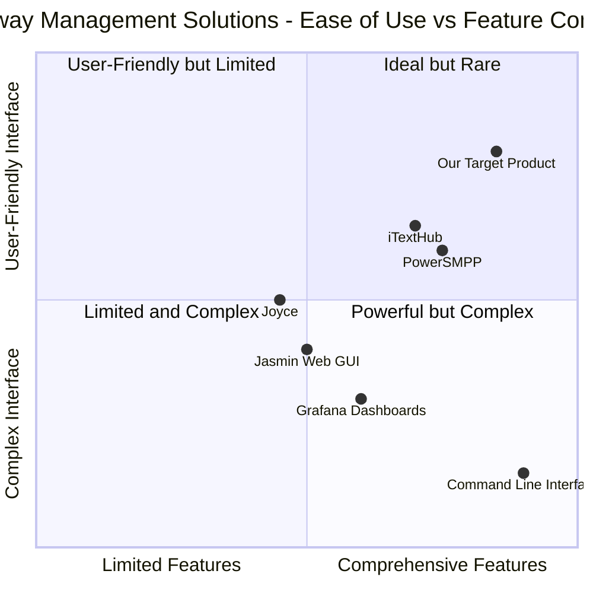

# Product Requirements Document: Jasmin SMPP SMS Gateway Web Interface

## Project Information
- **Project Name**: jasmin_smpp_web_dashboard
- **Programming Language**: React, JavaScript, Tailwind CSS
- **Original Requirements**: Create a Jasmin SMPP SMS Gateway website to manage it via web interface, including all CLI features in the web dashboard, and SMS statistics tracking by users. Final product to be published to the user's GitHub account.

## 1. Product Definition

### 1.1 Product Goals
1. **Comprehensive CLI Feature Integration**: Provide a web-based interface that encompasses all functionality available in the Jasmin SMS Gateway CLI, eliminating the need for direct command-line access.
2. **User-Centric Analytics**: Deliver robust SMS statistics tracking by user, enabling better monitoring, reporting, and billing capabilities.
3. **Streamlined Gateway Management**: Simplify the complex management tasks of Jasmin SMPP SMS Gateway through an intuitive, responsive web interface accessible from any device.

### 1.2 User Stories

1. **As an administrator**, I want to manage users, groups, and routing rules through a web interface so that I can efficiently configure the SMS gateway without memorizing CLI commands.

2. **As a business owner**, I want to view detailed statistics about SMS traffic by user, so that I can properly bill clients and monitor system usage.

3. **As an operations manager**, I want to monitor SMPP connections in real-time so that I can quickly troubleshoot connectivity issues.

4. **As a technical support team member**, I want to access SMS delivery reports and system logs through a web interface so that I can assist customers with messaging issues.

5. **As a system integrator**, I want to configure advanced routing rules via a visual interface so that I can implement complex message workflows without error-prone CLI commands.

### 1.3 Competitive Analysis

| Product | Pros | Cons |
|---------|------|------|
| **PowerSMPP Web Interface** | • Provides user management<br>• Offers basic reporting<br>• Has transaction tracking | • Expensive licensing<br>• Limited integration with other systems<br>• Closed-source with limited customization |
| **iTextHub** | • Good B2C portal<br>• User control panels<br>• Built-in billing | • Not specifically designed for Jasmin<br>• Limited access to advanced features<br>• High learning curve |
| **Joyce (Django-based)** | • Open-source<br>• Basic Jasmin management<br>• User/Group management | • Limited statistics<br>• No advanced routing UI<br>• Lacks monitoring features |
| **Jasmin Web GUI** | • Direct Jasmin configuration<br>• Open-source<br>• Basic routing setup | • Limited visual appeal<br>• No statistics dashboard<br>• Minimal user management |
| **Custom Grafana Dashboards** | • Highly customizable visualizations<br>• Real-time monitoring<br>• Alert capabilities | • Requires separate setup<br>• No direct Jasmin management<br>• Technical expertise required |
| **Command Line Interface (CLI)** | • Complete control<br>• Fast for experts<br>• Direct access to all features | • No visualization<br>• High learning curve<br>• Error-prone manual entry |
| **Our Target Product** | • Comprehensive feature set<br>• Intuitive web interface<br>• Detailed user statistics<br>• Visual routing configuration<br>• Real-time monitoring | • New product with potential early bugs<br>• Initial setup complexity |

### 1.4 Competitive Quadrant Chart



## 2. Technical Specifications

### 2.1 Requirements Analysis

The Jasmin SMPP SMS Gateway Web Interface must provide comprehensive management capabilities through an intuitive web interface, replacing the need for CLI interaction while adding powerful statistics tracking and visualization features. The web interface must maintain all the functionality of the original CLI while providing improved usability, visualization, and reporting capabilities.

The system architecture will consist of:

1. **Frontend**: React-based responsive web application with Tailwind CSS for styling
2. **Backend**: RESTful API service that interfaces with Jasmin's internal APIs
3. **Database**: Storage for statistics, logs, and user activity
4. **Authentication**: Secure user authentication system with role-based access control

The application must interface with Jasmin SMS Gateway using available APIs and integration points, including:

- Jasmin's Management PB API
- Jasmin's HTTP API for sending/receiving messages
- Custom data collection for statistics gathering

### 2.2 Requirements Pool

#### P0 (Must Have)

1. **User Authentication & Authorization**
   - User login/logout functionality
   - Role-based access control (Admin, Manager, User)
   - Session management with timeout

2. **User & Group Management**
   - Create, update, delete, and view users
   - Create, update, delete, and view groups
   - Assign users to groups
   - Enable/disable users
   - SMPP unbind/ban functionality
   - Password management

3. **SMPP Connection Management**
   - List, create, update, delete SMPP client connectors
   - Start/stop connectors
   - View connector details and status
   - Real-time connection monitoring

4. **Basic Routing Configuration**
   - Configure MO (Mobile Originated) routes
   - Configure MT (Mobile Terminated) routes
   - Visual representation of routing paths

5. **Basic Statistics**
   - SMS throughput (messages sent/received)
   - Delivery success/failure rates
   - User-specific traffic volumes

6. **Configuration Persistence**
   - Save and load configurations
   - Configuration backup/restore

#### P1 (Should Have)

1. **Advanced Routing Configuration**
   - Filter creation and management
   - Route priority management
   - Visual routing rule builder
   - Route testing and validation

2. **Enhanced Statistics & Reporting**
   - Detailed user activity reporting
   - SMS traffic analysis by destination
   - Customizable date ranges for reports
   - Export reports to CSV/PDF
   - Scheduled report generation

3. **HTTP Connection Management**
   - Configure HTTP client connectors
   - Test HTTP connections
   - Monitor HTTP API usage

4. **Real-time Monitoring Dashboard**
   - System health indicators
   - Queue depth monitoring
   - Resource utilization metrics
   - Alert configurations

5. **Message Interceptor Management**
   - Configure message interception rules
   - Test interceptor functionality
   - Monitor intercepted messages

#### P2 (Nice to Have)

1. **Advanced Visualization**
   - Interactive charts and graphs
   - Geographical message distribution
   - Heat maps for traffic analysis

2. **API Documentation & Testing**
   - Interactive API documentation
   - API testing interface
   - Code examples for integration

3. **Multi-language Support**
   - Interface translation
   - Unicode character preview

4. **Theme Customization**
   - Light/dark mode toggle
   - Custom branding options
   - UI color scheme customization

5. **Billing Integration**
   - Credit management
   - Invoice generation
   - Payment tracking

### 2.3 UI Design Draft

#### Main Dashboard Layout

```
+----------------------------------------------------------------------+
|                         Header/Navigation                             |
+----------------------------------------------------------------------+
|                                                                      |
| +----------------+   +----------------------------------------+       |
| |                |   |                                        |       |
| |  Sidebar Menu  |   |  Main Content Area                     |       |
| |  - Dashboard   |   |  (Dynamic based on selected menu item) |       |
| |  - Users       |   |                                        |       |
| |  - Groups      |   |                                        |       |
| |  - Connectors  |   |                                        |       |
| |  - Routes      |   |                                        |       |
| |  - Statistics  |   |                                        |       |
| |  - Settings    |   |                                        |       |
| |                |   |                                        |       |
| +----------------+   +----------------------------------------+       |
|                                                                      |
+----------------------------------------------------------------------+
|                               Footer                                 |
+----------------------------------------------------------------------+
```

#### Key Screens

1. **Dashboard**
   - Key performance metrics
   - System status indicators
   - Recent activity feed
   - Quick action buttons

2. **User Management**
   - User listing with search/filter
   - User creation/edit forms
   - User activity monitoring
   - Group assignment interface

3. **SMPP Connector Management**
   - Connector status dashboard
   - Connector configuration form
   - Connection testing interface
   - Performance metrics

4. **Routing Configuration**
   - Visual route builder
   - Rule prioritization interface
   - Filter configuration
   - Route testing tools

5. **Statistics Dashboard**
   - User-specific statistics
   - Message volume charts
   - Delivery rate analytics
   - Filter-based reporting

### 2.4 Open Questions

1. **API Integration Approach**: What is the most efficient method to integrate with Jasmin's internal APIs? Should we use direct database access, existing APIs, or create a new middleware layer?

2. **Statistics Storage**: Where and how should statistics data be stored for optimal performance and minimal impact on the core Jasmin system?

3. **Authentication Integration**: Should the web interface use Jasmin's existing authentication system or implement its own with SSO capabilities?

4. **Deployment Strategy**: What is the preferred deployment method - standalone application, containerized service, or integrated module?

5. **Performance Impact**: How can we ensure that the statistics collection process doesn't negatively impact the performance of the core SMS gateway functionality?

## 3. Development & Implementation Plan

### 3.1 Development Phases

1. **Phase 1: Core Functionality** (6-8 weeks)
   - Basic authentication system
   - User and group management
   - SMPP connector configuration
   - Simple routing setup
   - System status dashboard

2. **Phase 2: Advanced Features** (4-6 weeks)
   - Enhanced statistics collection
   - Advanced routing configuration
   - HTTP connector management
   - Report generation

3. **Phase 3: Optimization & Additional Features** (4 weeks)
   - Performance tuning
   - Advanced visualizations
   - API documentation
   - Additional customization options

### 3.2 Technology Stack

- **Frontend**: React, Redux, Tailwind CSS, Chart.js
- **Backend**: Node.js/Express or Python/Django
- **Database**: MongoDB or PostgreSQL
- **Messaging**: WebSockets for real-time updates
- **Deployment**: Docker containers, GitHub Actions for CI/CD

## 4. Success Metrics

1. **Usability**: Reduction in time spent on common administrative tasks compared to CLI
2. **Adoption**: Percentage of CLI commands replaced by web interface usage
3. **Performance**: Message throughput maintained at CLI-equivalent levels
4. **Reliability**: Uptime of web interface (target: 99.9%)
5. **User Satisfaction**: User feedback ratings for interface usability

## 5. Conclusion

The Jasmin SMPP SMS Gateway Web Interface will provide a comprehensive, user-friendly alternative to the command-line interface while adding powerful statistics and visualization capabilities. By combining all CLI features with intuitive web-based management tools and detailed user-specific analytics, this product will significantly enhance the usability and value of the Jasmin SMS Gateway platform.

The successful implementation of this project will enable administrators to efficiently manage the SMS gateway through a modern web interface, allow business owners to track usage for billing purposes, and provide operations teams with the tools needed for effective monitoring and troubleshooting.